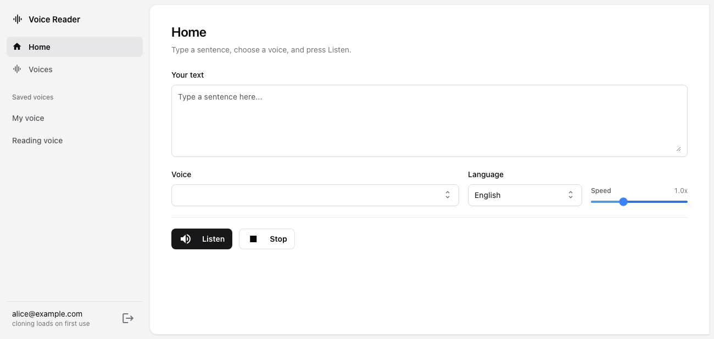

# Voice Reader

**Live at [voice.jaysoncleofas.com](https://voice.jaysoncleofas.com)**

A NiceGUI app: type a sentence, press **Listen**, and hear it read aloud — either
by one of your browser's built-in voices, or **in your own recorded voice**.

Built-in voices are spoken client-side with the Web Speech API. Recorded voices
are cloned server-side with [Coqui XTTS-v2](https://github.com/idiap/coqui-ai-TTS),
which runs entirely inside the container — no API keys, and no audio leaves the
machine. Each account's voices are private to that account.



## Quick start

```bash
cp .env.example .env      # fill in the two secrets
docker compose up -d --build
```

Then open http://localhost:8080 and create an account.

| Command | What it does |
| --- | --- |
| `docker compose up -d --build` | Build and start in the background |
| `docker compose up --build` | Run in the foreground, streaming logs |
| `docker compose logs -f` | Follow the logs |
| `docker compose down` | Stop and remove the containers |
| `docker compose ps` | Show container status |

## Pages

| Route | What it is |
| --- | --- |
| `/login`, `/register` | Accounts |
| `/` | **Home** — type text, pick a voice, press Listen |
| `/voices` | **Voices** — your voice library, with **Create voice** |

## Recording your voice

1. Go to **Voices** and press **Create voice**.
2. Name it, press **Start recording**, and read the passage aloud to the end.
3. Press **Stop and save**. The voice joins your library.
4. On **Home**, pick it from the **Voice** dropdown and press **Listen**.

A passage is provided because a cloned voice is only as good as its reference:
reading prepared text keeps you fluent and covers a wide spread of sounds.
**Another passage** cycles through five of them.

## Languages

Cloned voices can speak any of the 17 languages XTTS-v2 supports, chosen with the
**Language** dropdown: English, Spanish, French, German, Italian, Portuguese,
Polish, Turkish, Russian, Dutch, Czech, Arabic, Chinese, Hungarian, Korean,
Japanese and Hindi.

**Tagalog is not supported by the model.** Choose **Spanish** for Tagalog text —
the two share the same five pure vowels and much of their consonant inventory, so
Spanish pronounces Tagalog far closer than English does.

## Where things are stored

Split by what each store is good at:

- **Postgres** — accounts and voice metadata (owner, name, length, created date).
- **The filesystem** — the audio itself, on a Docker volume. Audio files are large
  and always read whole, so they are handed to ffmpeg and the model by path.

```
/data/
├── voices/<voice-id>/
│   ├── sample.wav     normalised mono 24 kHz reference clip
│   └── source.webm    the untouched browser recording
├── models/            downloaded model weights (~1.8 GB)
└── cache/<voice-id>/  rendered clips, reclaimed when the voice is deleted
```

Both volumes survive image rebuilds.

## Project layout

```
.
├── Dockerfile               # multi-stage; compiles deps with no prebuilt wheels
├── docker-compose.yml       # app + postgres
└── app/
    ├── main.py              # wires storage, API, pages; starts the server
    ├── config.py            # settings from environment variables
    ├── db.py                # postgres pool and schema
    ├── auth.py              # session helpers
    ├── deps.py              # shared library + engine instances
    ├── api/routes.py        # REST endpoints, all account-scoped
    ├── pages/
    │   ├── layout.py        # sidebar shell, auth guard, field helper
    │   ├── auth_pages.py    # login and register
    │   ├── home.py          # the reader
    │   └── voices.py        # library table + create dialog
    ├── services/
    │   ├── audio.py         # ffmpeg normalisation and duration probing
    │   ├── library.py       # per-account voice library
    │   ├── users.py         # accounts, scrypt password hashing
    │   ├── languages.py     # the model's supported languages
    │   ├── prompts.py       # passages to read while recording
    │   ├── speech.py        # Web Speech API snippets
    │   └── tts.py           # XTTS-v2 cloning, lazy-loaded and cached
    └── static/
```

## Theme

The interface follows the look of [Catalyst](https://catalyst-demo.tailwindui.com/):
a tinted sidebar beside a white content panel, zinc neutrals, hairline borders,
stacked field labels, and a blue focus ring. Catalyst is a commercial Tailwind UI
package, so none of its component source is used here; the look is rebuilt with
plain CSS and Tailwind utilities in [styles.css](app/static/css/styles.css).

Much of that stylesheet exists to tame Quasar: NiceGUI renders Quasar widgets that
ship their own Material styling, so form controls are overridden at the component
level. Light is the default; `VOICE_DARK=true` switches to the dark palette.

## Configuration

| Variable | Default | Purpose |
| --- | --- | --- |
| `VOICE_DATABASE_URL` | `postgresql://voice:voice@db:5432/voice_reader` | Postgres connection |
| `VOICE_STORAGE_SECRET` | — | **Set this.** Signs the session cookie |
| `POSTGRES_PASSWORD` | — | **Set this** in production |
| `VOICE_TITLE` | `Voice Reader` | Page and window title |
| `VOICE_PORT` | `8080` | Published port |
| `VOICE_DARK` | `false` | Dark palette instead of light |
| `VOICE_TTS_MODEL` | `tts_models/multilingual/multi-dataset/xtts_v2` | Cloning model |
| `VOICE_TTS_LANGUAGE` | `en` | Default synthesis language |
| `VOICE_TTS_ENABLED` | `true` | Set `false` to run browser-voices-only |

## Notes

- Browser voices come from the OS, so the built-in list differs per machine.
- Recording needs a secure context: `localhost` or HTTPS.
- XTTS-v2 is released under the [Coqui Public Model License](https://coqui.ai/cpml),
  which permits **non-commercial** use only.
